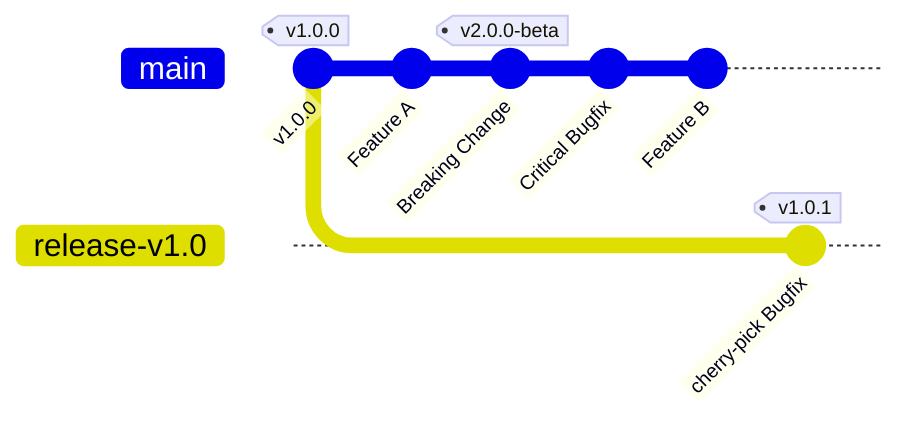

# Release Procedure

# Table of Contents

- [Overview](#overview)
- [General Information](#general-information)
- [Automated Release Process (Primary Method)](#automated-release-process-primary-method)
- [Manual Release Process (Fallback Method)](#manual-release-process-fallback-method)

## Overview

This document outlines the standard procedure for creating new releases of the STACKIT machine-controller-manager.

## General Information

When releasing machine-controller-manager-provider-stackit, we follow semantic versioning (see https://semver.org/).

For major version changes, the configuration typically needs to be adapted to accommodate breaking changes before successfully upgrading. For minor and patch updates, no configuration adjustments are required.

Both major and minor releases are created from the main branch. Patch releases are created from a release branch that is based on a minor version release.

### Hotfixes

A Hotfix is required when a critical bug or security vulnerability is discovered in a stable version that is currently in production, but the main branch has already moved forward with breaking changes or features not yet ready for release.

We follow a "Fix-First-in-Main" policy. All fixes must be merged into the main branch before being cherry-picked into a specific release branch.

For example:



> In the example above, the "Critical Bugfix" cannot be released via the main branch because main contains a "Breaking Change" that isn't ready for general availability. By using a release branch (release-v1.0), we can ship the fix as a patch (v1.0.1) immediately.

1. Create a Pull Request (PR) targeting the main branch. Once reviewed and merged, identify the PR number.
2. If a branch for your specific minor version (e.g., release-v1.x) doesn't exist yet, create it from the last known stable tag:
   ```bash
   git fetch --all --tags
   git checkout -b release-vx.y vx.y.0
   git push -u origin release-vx.y
   ```
3. Use `/cherry-pick release-vx.y` command in the PR with the changes. The prow will open the cherry-pick PR automatically.
4. Once the cherry-pick PR has been reviewed, approved, and merged, you can promote the changes by creating a new patch release of machine-controller-manager-provider-stackit.
   For this, publish the draft release on the `release-vx.y` branch for the next patch version (`vx.y.z`) (see [Publishing a Release](#-publishing-a-release)).

## Automated Release Process (Primary Method)

When changes are merged into `main` or a `release-v*` branch, the `release-tool` creates a draft release to preview the upcoming updates.
The tool automatically determines the appropriate version tag based on the target branch and the labels of the merged Pull Requests:

To publish a release, follow these steps:

1. Open the repository's releases page.
2. Navigate to the corresponding draft release (minor/major for `main`, patch for `release-v*`).
3. Review to-be-released changes by checking the release notes.
4. Edit the release by pressing the pen icon.
5. Change `REPLACE_ME` with your github username.
6. Press the "Publish release" button.

## Manual Release Process (Fallback Method)

If the `release-tool` or its associated Prow job fails, use the GitHub web UI to create and publish a release:

1. Go to the repository on GitHub and click **Releases** on the right side, then click **Draft new release**.

2. Open the **Select tag** dropdown and choose **Create new tag** at the bottom. Enter the new tag name (for example `v2.1.0`) and pick the target branch/commit, then confirm.

3. Click **Generate release notes** to let GitHub populate the changelog.

4. In the release description, add a line `Released by @<your github handle>` to indicate the publisher.

5. Click **Publish release** to create the release.

Publishing a new release triggers the same Prow release job that builds and publishes the final container images.
