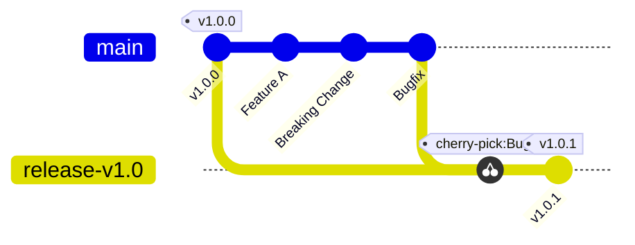

# Release Procedure

# Table of Contents

- [Overview](#overview)
- [General Information](#general-information)
- [Automated Release Process (Primary Method)](#automated-release-process-primary-method)
- [Manual Release Process (Fallback Method)](#manual-release-process-fallback-method)

## Overview

This document outlines the standard procedure for creating new releases of the STACKIT machine-controller-manager.

## General Information

- **Branching Strategy:** All major and minor releases are created from `main` branches. Patch releases are created from  `release-v*` branches (see [Patch Release (Hotfix)](#hotfixes) for more details).
- **Versioning:** Versioning follows official [SemVer 2.0](https://semver.org/)
- **CI/CD System:** All release and image builds are managed by our **Prow CI** infrastructure.

### Hotfixes

A Hotfix is required when a critical bug or security vulnerability is discovered in a stable version that is currently in use, but the main branch has already moved forward with breaking changes or features.

We follow a "Fix-First-in-Main" policy. All fixes must be merged into the main branch before being cherry-picked into a specific release branch.

For example:



> As shown in the example, the `Critical Bugfix` cannot be released directly from main because that branch already contains unreleased work (like `Feature A` or the `Breaking Change`) that shouldn't be shipped alongside a patch. Isolating the fix on `release-v1.0` ensures we release only the `Critical Bugfix` in the patch release (`v1.0.1`).

1. Create a Pull Request with the bug fix targeting the main branch.
2. Review and merge the `main` branch Pull Request.
3. If a branch for your specific minor version (e.g., `release-v1.0`) doesn't exist yet, create it from the corresponding tag:
   ```bash
   git fetch --all --tags
   git checkout -b release-vx.y vx.y.0
   git push -u origin release-vx.y
   ```
4. Use `/cherry-pick release-vx.y` command in the `main` branch Pull Request. The prow will open the cherry-pick Pull Request against `release-vx.y` branch automatically.
5. Once the cherry-pick PR has been reviewed, approved, and merged, you can promote the changes by creating a new patch release of machine-controller-manager-provider-stackit.
   For this, publish the draft release on the `release-vx.y` branch for the next patch version (`vx.y.z`) (see [Automated Release Process (Primary Method)](#automated-release-process-primary-method)).

## Automated Release Process (Primary Method)

The primary release method is automated using a tool called `release-tool`. This process is designed to be straightforward and require minimal manual intervention.

1. **Draft Creation:** On every successful merge (post-submit) to the `main` branch and `release-v*` branchs, a Prow job automatically runs the `release-tool`. This tool creates a new draft release on GitHub or updates the existing one with a changelog generated from recent commits.
2. **Publishing the Release:** When the draft is ready, navigate to the repository's "Releases" page on GitHub. Locate the draft, review the changelog, replace the placeholder with your GitHub handle and publish it by clicking the "Publish release" button.

Publishing the release automatically creates the corresponding Git tag (e.g., `v1.3.1`), which triggers a separate Prow job to build the final container images and attach them to the GitHub release.

## Manual Release Process (Fallback Method)

If the `release-tool` or its associated Prow job fails, use the GitHub web UI to create and publish a release:

1. Go to the repository on GitHub and click **Releases** on the right side, then click **Draft new release**.

2. Open the **Select tag** dropdown and choose **Create new tag** at the bottom. Enter the new tag name (for example `v2.1.0`) and pick the target branch/commit, then confirm.

3. Click **Generate release notes** to let GitHub populate the changelog.

4. In the release description, add a line `Released by @<your github handle>` to indicate the publisher.

5. Click **Publish release** to create the release.

Publishing a new release triggers the same Prow release job that builds and publishes the final container images.
